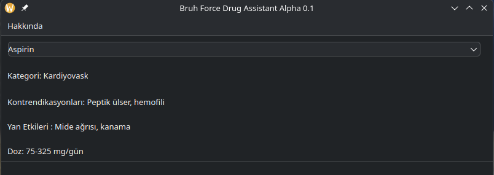

# Bruh-Force-Drug-Assistant



Basit bir PyQt5 tabanlı masaüstü uygulaması. Kullanıcıya bir ilaç listesi sunar ve seçilen ilacın kategori, kontrendikasyon, yan etki ve doz bilgilerini gösterir.

---

## Özellikler
- İlaçlar CSV dosyasından okunur ve alfabetik olarak sıralanır.
- Seçilen ilacın detaylı bilgileri ekranda gösterilir.
- Kullanıcı dostu ve sade arayüz.

---

## Gereksinimler

- Python 3.7 veya üzeri
- PyQt5
- pandas

```bash
pip install PyQt5 pandas
```

---
## Çalıştırmak için
```bash
python bruhforce drug assistant.py
```
